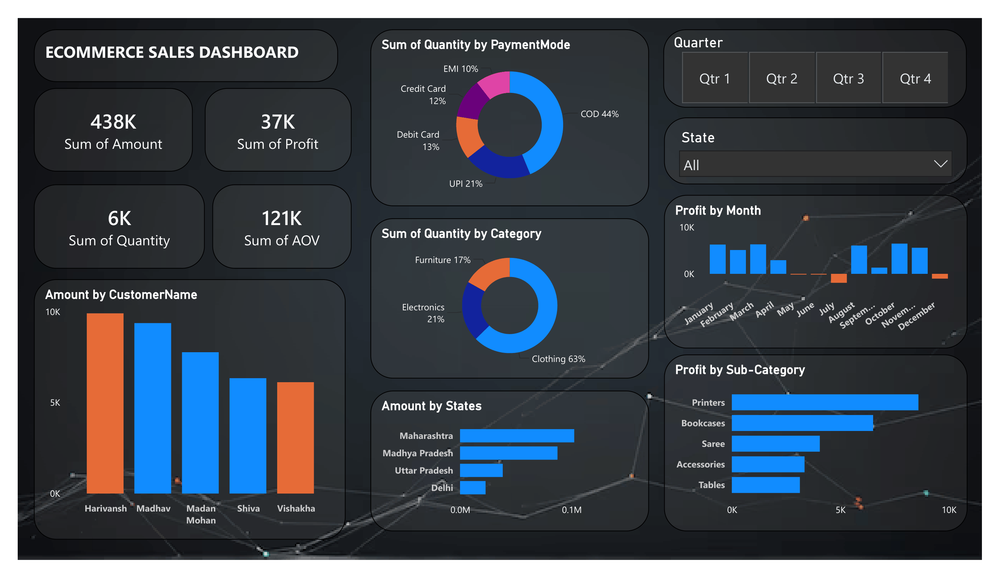

# 📊 Sales Analysis Dashboard

## 📌 Project Overview

The Sales Analysis Dashboard is an interactive Power BI project developed to analyze sales performance, revenue trends, customer behavior, and product performance. The dashboard provides actionable insights that help businesses monitor KPIs, identify growth opportunities, and make data-driven decisions.

---

## 🎯 Objectives

- Analyze overall sales performance.
- Track revenue and profit trends.
- Identify top-performing products and categories.
- Understand customer purchasing behavior.
- Monitor key business KPIs.
- Enable interactive exploration of sales data.

---

## 📊 Dashboard Features

### KPI Metrics

- 💰 Total Sales
- 📈 Total Revenue
- 📦 Total Orders
- 👥 Total Customers
- 💵 Average Order Value

### Interactive Visualizations

- Sales by Category
- Revenue Trends Over Time
- Product Performance Analysis
- Customer Segmentation
- Regional Sales Analysis
- Top-Selling Products

### Interactive Filters

Users can filter data by:

- Product Category
- Region
- Customer Segment
- Product
- Date Range

---

## 🛠️ Tools & Technologies Used

| Tool | Purpose |
|--------|----------|
| Power BI | Dashboard Development |
| Power Query | Data Transformation |
| DAX | KPI & Measure Creation |
| Excel / CSV | Data Source |
| GitHub | Version Control & Portfolio |

---

## 📈 Business Insights

### Revenue Analysis
- Track total revenue generated across different periods.
- Identify seasonal sales patterns.
- Compare category-wise sales performance.

### Product Performance
- Discover top-selling products.
- Analyze category contribution to overall revenue.
- Identify underperforming products.

### Customer Analysis
- Understand customer purchasing behavior.
- Identify high-value customers.
- Analyze repeat purchase trends.

### Sales Trends
- Monitor growth patterns over time.
- Detect peak sales periods.
- Support strategic planning with data-driven insights.

---

## 💡 Business Recommendations

### 1. Focus on High-Performing Products
Increase inventory and marketing efforts for products generating the highest revenue.

### 2. Improve Low-Performing Categories
Review pricing strategies, promotions, and product positioning.

### 3. Strengthen Customer Retention
Implement loyalty programs and personalized offers for repeat customers.

### 4. Optimize Sales Strategy
Use category and customer insights to improve targeting and conversion rates.

### 5. Monitor KPIs Regularly
Track dashboard metrics frequently to identify trends and opportunities.

---

## 📂 Project Structure

Sales-Analysis-Dashboard/
│
├── Sales_analysis_dashboard.pbix
├── README.md
│
├── images/
│ └── dashboard.png
│
├── dataset/
│ ├── Details.csv
| └── Orders.csv
---

## 🚀 How to Use

1. Download the `.pbix` file.
2. Open it using Power BI Desktop.
3. Refresh the data source if required.
4. Explore dashboard visuals using slicers and filters.
5. Analyze KPIs and business insights.

---

## 📷 Dashboard Preview

---

## 🎓 Skills Demonstrated

- Data Analysis
- Business Intelligence
- Data Visualization
- Dashboard Design
- Power BI Development
- DAX Calculations
- KPI Reporting
- Data Modeling

---

## 🔮 Future Enhancements

- Sales Forecasting
- Customer Lifetime Value Analysis
- Customer Churn Prediction
- Profitability Analysis
- Automated Reporting

---

## 👨‍💻 Author

**Kartik**

Aspiring Data Analyst | Power BI | SQL | Python | Data Visualization

⭐ If you found this project useful, consider starring the repository.